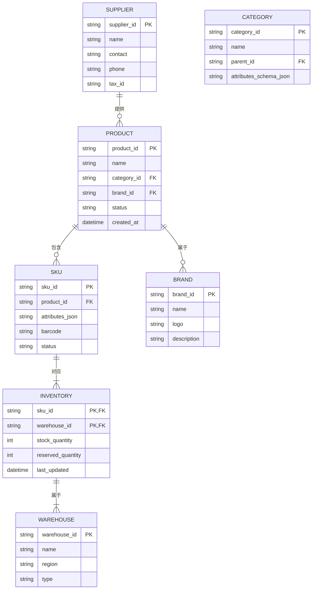
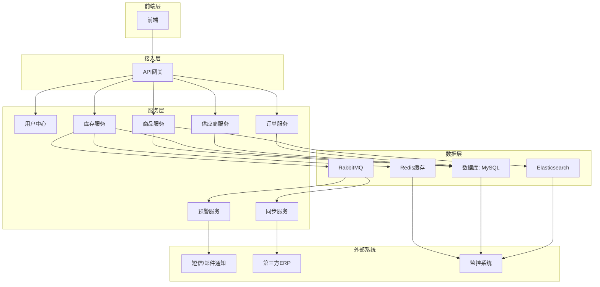

# 电商商品管理系统产品需求文档（PRD）

## 1. 功能需求清单

### 商品管理模块

#### 1.1 商品创建与编辑
- **功能名称**：商品创建与编辑
- **业务目标**：支持商品基础信息、属性、图文描述等的创建与修改
- **触发条件**：用户进入商品管理界面，点击"新增商品"或"编辑商品"按钮
- **输入/输出**：
  - 输入：商品名称、分类、品牌、属性、图文描述等
  - 输出：创建/更新成功的商品信息
- **异常处理**：
  - 必填字段缺失时拒绝提交并返回错误信息
  - 商品名称重复时返回错误码ERR_PRODUCT_NAME_DUPLICATE

#### 1.2 商品上下架控制
- **功能名称**：商品上下架控制
- **业务目标**：管理商品的发布状态，控制商品在前台的显示
- **触发条件**：用户在商品列表中选择商品，点击"上架"或"下架"按钮
- **输入/输出**：
  - 输入：商品ID、操作类型（上架/下架）
  - 输出：操作成功提示，商品状态更新
- **异常处理**：
  - 商品不存在时返回错误码ERR_PRODUCT_NOT_FOUND
  - 操作权限不足时返回错误码ERR_PERMISSION_DENIED

#### 1.3 商品分类管理
- **功能名称**：商品分类管理
- **业务目标**：支持无限级商品分类的创建、编辑、删除
- **触发条件**：用户进入分类管理界面，进行分类操作
- **输入/输出**：
  - 输入：分类名称、父分类ID、属性模板
  - 输出：分类创建/更新成功信息
- **异常处理**：
  - 分类名称重复时返回错误码ERR_CATEGORY_NAME_DUPLICATE
  - 子分类存在时禁止删除父分类

#### 1.4 品牌管理
- **功能名称**：品牌管理
- **业务目标**：对商品品牌进行统一管理，支持品牌信息的维护和查询
- **触发条件**：用户进入品牌管理界面，进行品牌操作
- **输入/输出**：
  - 输入：品牌名称、logo、描述
  - 输出：品牌创建/更新成功信息
- **异常处理**：
  - 品牌名称重复时返回错误码ERR_BRAND_NAME_DUPLICATE

### 库存管理模块

#### 2.1 实时库存同步
- **功能名称**：实时库存同步
- **业务目标**：确保多平台库存数据的实时一致性，避免超卖
- **触发条件**：商品库存发生变化（如订单创建、取消、退款）
- **输入/输出**：
  - 输入：SKU ID、库存变动数量、操作类型
  - 输出：库存更新成功信息，同步至各平台
- **异常处理**：
  - 库存不足时返回错误码ERR_INVENTORY_INSUFFICIENT
  - 同步失败时记录异常并重试

#### 2.2 多仓库存管理
- **功能名称**：多仓库存管理
- **业务目标**：支持多个仓库的库存独立管理和分配
- **触发条件**：用户进入库存管理界面，查看或调整各仓库库存
- **输入/输出**：
  - 输入：仓库ID、SKU ID、库存数量
  - 输出：库存更新成功信息
- **异常处理**：
  - 仓库不存在时返回错误码ERR_WAREHOUSE_NOT_FOUND
  - SKU不存在时返回错误码ERR_SKU_NOT_FOUND

#### 2.3 库存预警
- **功能名称**：库存预警
- **业务目标**：当库存低于阈值时触发告警，避免缺货
- **触发条件**：SKU库存数量低于预设阈值
- **输入/输出**：
  - 输入：SKU ID、库存阈值
  - 输出：预警通知（短信/邮件）
- **异常处理**：
  - 预警通知发送失败时记录日志并重试

### SKU管理模块

#### 3.1 多维度SKU管理
- **功能名称**：多维度SKU管理
- **业务目标**：支持无限级商品属性（如颜色、尺寸、配置、包装），智能组合SKU
- **触发条件**：用户在创建/编辑商品时，选择商品属性
- **输入/输出**：
  - 输入：商品ID、属性名称、属性值
  - 输出：生成的SKU列表
- **异常处理**：
  - 属性冲突时返回错误码ERR_ATTR_CONFLICT
  - SKU数量超过限制时返回错误码ERR_SKU_LIMIT_EXCEEDED

#### 3.2 动态规格筛选
- **功能名称**：动态规格筛选
- **业务目标**：前台商城支持多条件筛选，提升用户体验
- **触发条件**：用户在前台商城搜索商品时，使用筛选条件
- **输入/输出**：
  - 输入：筛选条件（如颜色、尺寸、价格范围）
  - 输出：符合条件的商品列表
- **异常处理**：
  - 筛选条件无效时返回错误码ERR_FILTER_INVALID

### 供应商管理模块

#### 4.1 供应商信息管理
- **功能名称**：供应商信息管理
- **业务目标**：管理供应商的基本信息、联系方式、资质等
- **触发条件**：用户进入供应商管理界面，进行供应商操作
- **输入/输出**：
  - 输入：供应商名称、联系人、电话、税号等
  - 输出：供应商创建/更新成功信息
- **异常处理**：
  - 供应商名称重复时返回错误码ERR_SUPPLIER_NAME_DUPLICATE
  - 税号格式错误时返回错误码ERR_TAX_ID_INVALID

#### 4.2 供应商商品关联
- **功能名称**：供应商商品关联
- **业务目标**：建立供应商与商品的关联关系，便于采购管理
- **触发条件**：用户在编辑商品时，选择供应商
- **输入/输出**：
  - 输入：商品ID、供应商ID
  - 输出：关联成功信息
- **异常处理**：
  - 供应商不存在时返回错误码ERR_SUPPLIER_NOT_FOUND

### 批量导入模块

#### 5.1 批量导入商品
- **功能名称**：批量导入商品
- **业务目标**：支持批量导入商品信息，提高工作效率
- **触发条件**：用户进入批量导入界面，上传商品数据文件
- **输入/输出**：
  - 输入：Excel/CSV格式的商品数据文件
  - 输出：导入成功/失败信息，失败原因
- **异常处理**：
  - 文件格式错误时返回错误码ERR_FILE_FORMAT_INVALID
  - 数据格式错误时返回错误码ERR_DATA_FORMAT_INVALID

#### 5.2 批量调整价格/库存
- **功能名称**：批量调整价格/库存
- **业务目标**：支持批量修改商品价格和库存，提高操作效率
- **触发条件**：用户在商品列表中选择多个商品，点击"批量操作"按钮
- **输入/输出**：
  - 输入：商品ID列表、价格/库存调整值
  - 输出：操作成功提示
- **异常处理**：
  - 部分商品操作失败时返回错误码ERR_PARTIAL_OPERATION_FAILED

### 预警机制模块

#### 6.1 库存预警
- **功能名称**：库存预警
- **业务目标**：当库存低于阈值时触发告警，避免缺货
- **触发条件**：SKU库存数量低于预设阈值
- **输入/输出**：
  - 输入：SKU ID、库存阈值
  - 输出：预警通知（短信/邮件）
- **异常处理**：
  - 预警通知发送失败时记录日志并重试

#### 6.2 异常预警
- **功能名称**：异常预警
- **业务目标**：商品被平台下架、订单退款导致库存回滚等突发情况，系统自动预警
- **触发条件**：发生商品下架、库存异常等情况
- **输入/输出**：
  - 输入：异常类型、相关商品/SKU信息
  - 输出：预警通知（短信/邮件）
- **异常处理**：
  - 预警通知发送失败时记录日志并重试

### 多仓协同模块

#### 7.1 多仓库存分配
- **功能名称**：多仓库存分配
- **业务目标**：根据订单地址、库存情况等因素，自动分配最优发货仓
- **触发条件**：订单创建时
- **输入/输出**：
  - 输入：订单信息、各仓库库存情况
  - 输出：分配结果（仓库ID、库存数量）
- **异常处理**：
  - 所有仓库库存不足时返回错误码ERR_ALL_WAREHOUSE_INSUFFICIENT

#### 7.2 多仓库存同步
- **功能名称**：多仓库存同步
- **业务目标**：确保各仓库之间的库存数据实时一致
- **触发条件**：仓库库存发生变化
- **输入/输出**：
  - 输入：仓库ID、SKU ID、库存变动数量
  - 输出：同步成功信息
- **异常处理**：
  - 同步失败时记录异常并重试

## 2. 实体关系图（ER图）

## 3. 系统架构图

### 模块职责说明

- **API网关**：统一鉴权、限流、路由
- **用户中心**：管理用户信息、权限控制
- **商品服务**：管理商品元数据、分类、属性模板、品牌
- **库存服务**：实时扣减、锁仓、多仓分配、库存预警
- **供应商服务**：管理供应商信息、供应商商品关联
- **订单服务**：处理订单创建、修改、查询
- **预警服务**：库存低于阈值、商品异常等情况触发告警
- **同步服务**：与第三方ERP系统同步数据
- **Redis缓存**：缓存热点数据，提高系统响应速度
- **Elasticsearch**：提供商品搜索、筛选功能
- **RabbitMQ**：异步处理库存变更、同步ERP等操作

### 数据流向说明

- **读操作**：前端 → API网关 → 各服务 → 数据库/缓存/搜索引擎
- **写操作**：前端 → API网关 → 各服务 → 数据库 → 消息队列 → 相关服务
- **触发关系**：订单创建 → 库存服务扣减库存 → 消息队列通知同步服务 → 同步至第三方ERP
- **预警流程**：库存服务检测到库存低于阈值 → 消息队列通知预警服务 → 预警服务发送短信/邮件通知