# 电商商品管理系统架构设计文档

## 1. 总体系统架构图

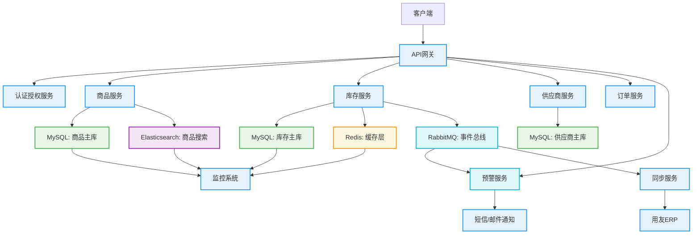

### 协议标注

- **客户端 → API网关**：HTTP/REST
- **API网关 → 各服务**：HTTP/REST
- **服务 → MySQL**：JDBC
- **服务 → Redis**：Redis Protocol
- **服务 → Elasticsearch**：HTTP/REST
- **服务 → RabbitMQ**：AMQP
- **同步服务 → 用友ERP**：HTTP/REST
- **预警服务 → 短信/邮件通知**：HTTP/REST

### 数据持久层说明

- **OLTP数据库**：MySQL，用于存储商品、库存、供应商等核心业务数据，确保事务一致性
- **缓存层**：Redis，用于缓存热点数据（如商品信息、库存状态），提高系统响应速度
- **搜索引擎**：Elasticsearch，用于商品搜索和动态规格筛选，支持高并发查询

## 2. 功能级执行流程图

### 功能：商品创建与编辑

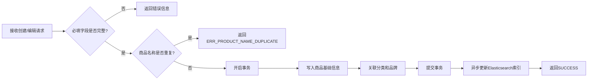

### 功能：商品上下架控制

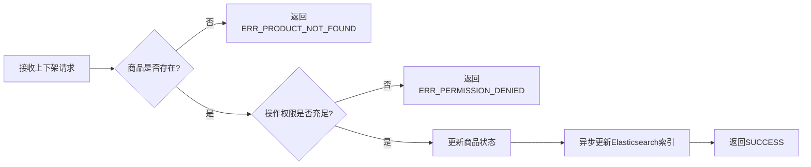

### 功能：商品分类管理

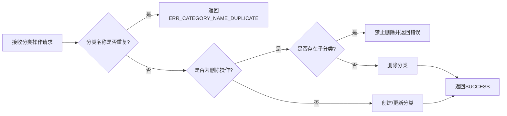

### 功能：品牌管理

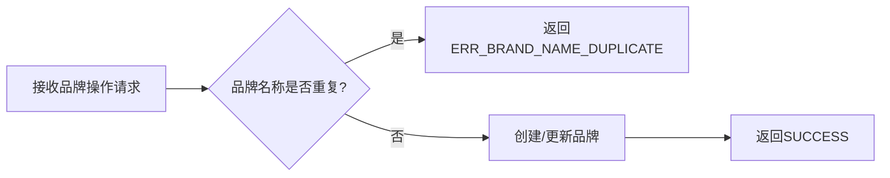

### 功能：实时库存同步

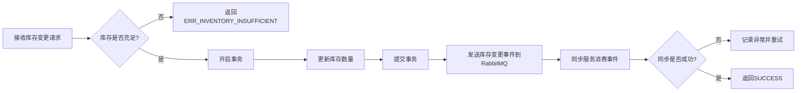

### 功能：多仓库存管理

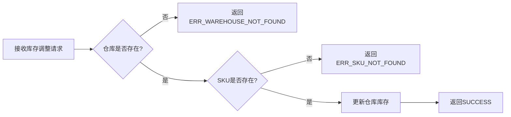

### 功能：库存预警

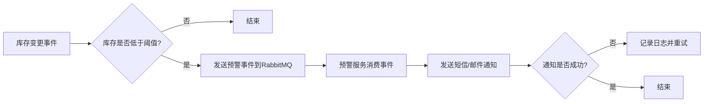

### 功能：多维度SKU管理

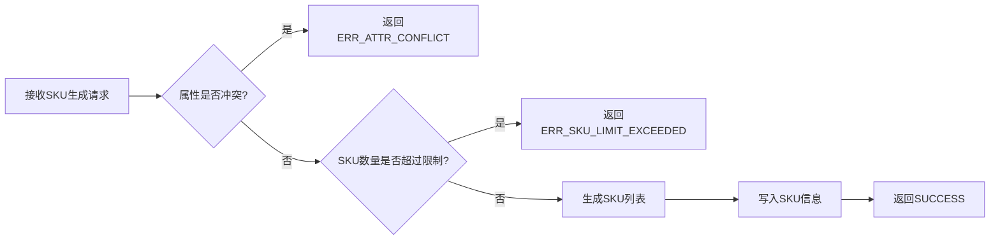

### 功能：动态规格筛选

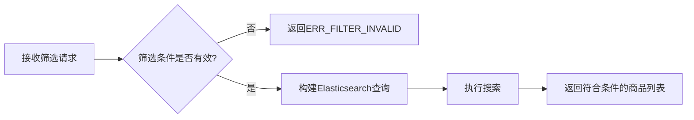

### 功能：供应商信息管理

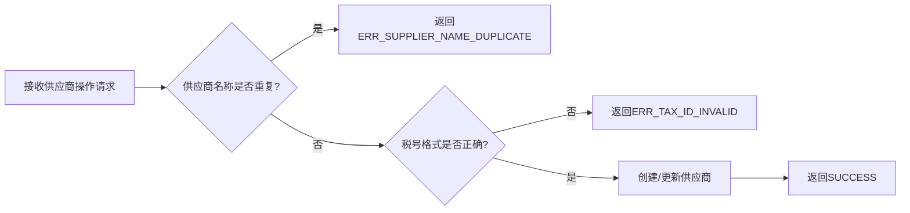

### 功能：供应商商品关联

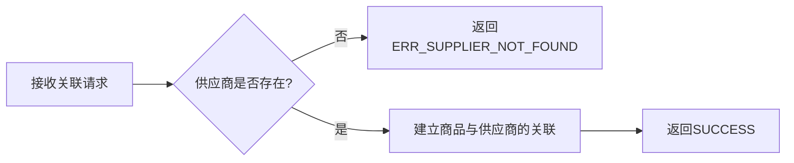

### 功能：批量导入商品

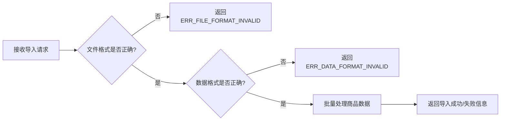

### 功能：批量调整价格/库存

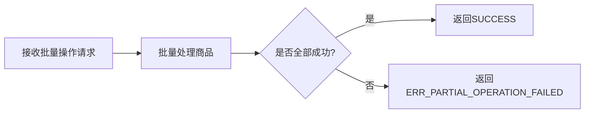

### 功能：异常预警

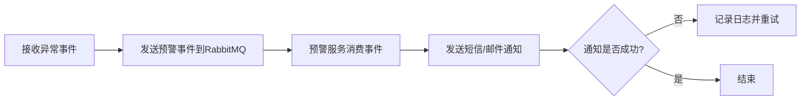

### 功能：多仓库存分配

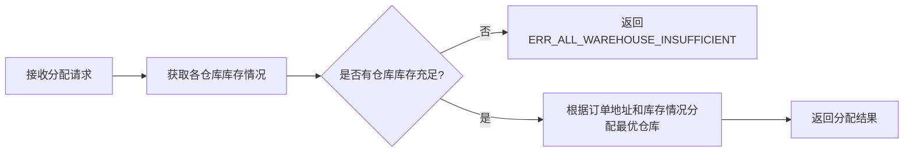

### 功能：多仓库存同步

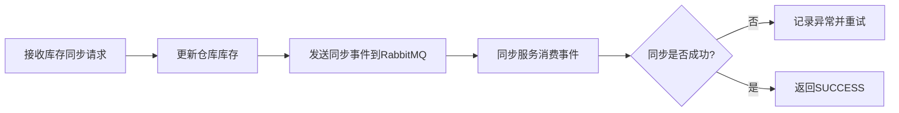

## 3. 技术选型对比与最优理由

| 技术组件 | 选项A | 选项B | 选项C | 最优选型 | 选择理由 |
|---------|-------|-------|-------|----------|----------|
| 缓存层 | Redis | Memcached | Apache Ignite | Redis | 支持持久化、数据结构丰富（Hash/List/ZSet）、单机QPS > 10万、支持Lua脚本实现原子锁，满足库存锁仓与动态属性缓存需求；Memcached无持久化，Ignite过重且运维复杂 |
| 消息队列 | RabbitMQ | Kafka | RocketMQ | RabbitMQ | 业务场景为低延迟、高可靠事件通知（库存变更、ERP同步），RabbitMQ支持优先级队列、TTL、死信交换，更适合事务型异步解耦；Kafka吞吐高但延迟高，RocketMQ企业级功能冗余 |
| 搜索服务 | Elasticsearch | Solr | MySQL全文索引 | Elasticsearch | 支持中文分词、动态映射、聚合分析，可实时索引SKU属性变更；Solr配置复杂，MySQL全文索引不支持高并发与模糊匹配 |
| 数据库 | MySQL | PostgreSQL | TiDB | MySQL | 事务强一致、生态成熟、与现有ERP系统兼容性最佳；PostgreSQL功能强但运维成本高，TiDB为分布式场景冗余，当前SKU量级<5000万，单机MySQL可支撑 |
| API网关 | Spring Cloud Gateway | Kong | Zuul | Spring Cloud Gateway | 与Spring Cloud生态无缝集成，支持动态路由、限流、熔断，性能优于Zuul，配置简单；Kong功能丰富但部署复杂 |
| 服务框架 | Spring Boot | Quarkus | Micronaut | Spring Boot | 生态成熟、社区活跃、与现有技术栈兼容性最佳，开发效率高；Quarkus和Micronaut启动快但生态相对薄弱 |
| 监控系统 | Prometheus + Grafana | Zabbix | ELK Stack | Prometheus + Grafana | 开源、轻量级、支持多维度监控和告警，与Spring Boot集成良好；Zabbix配置复杂，ELK Stack更适合日志分析 |
| 分布式事务 | Seata | TCC-Transaction | Atomikos | Seata | 支持AT、TCC、SAGA等多种模式，与Spring Cloud集成良好，性能优于其他方案；TCC-Transaction实现复杂，Atomikos主要用于JTA |
| 对象存储 | OSS | S3 | MinIO | OSS | 与阿里云生态集成良好，支持CDN加速，适合存储商品图片和视频；S3需额外配置，MinIO需要自建维护 |
| 容器编排 | Kubernetes | Docker Swarm | Mesos | Kubernetes | 生态成熟、社区活跃、功能丰富，支持自动扩缩容和服务发现；Docker Swarm功能简单，Mesos学习成本高 |