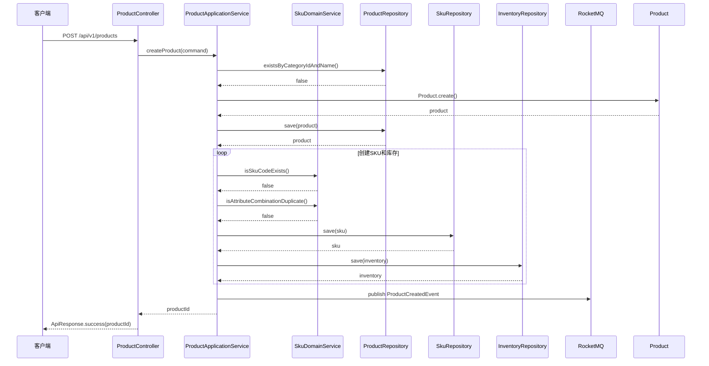
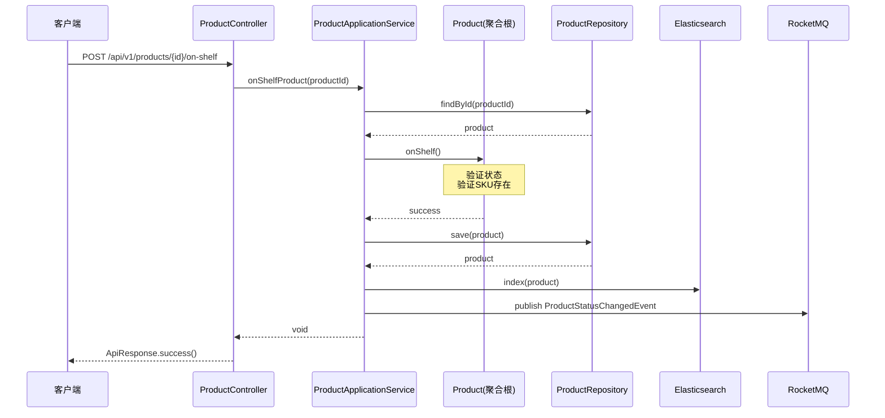
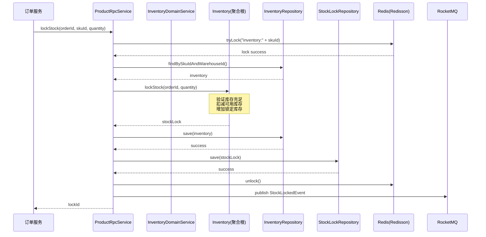
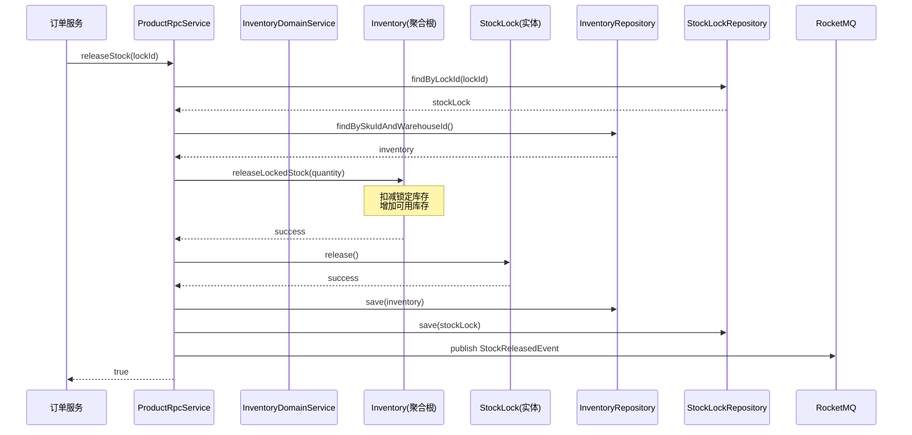

# 电商商品管理系统系统交互图文档

## 1. 系统架构图

```
┌─────────────────────────────────────────────────────────────────────────────┐
│                              前端应用层                                       │
│  ┌──────────────┐  ┌──────────────┐  ┌──────────────┐  ┌──────────────┐    │
│  │   管理后台    │  │   商家中心    │  │   商城H5     │  │   APP        │    │
│  └──────┬───────┘  └──────┬───────┘  └──────┬───────┘  └──────┬───────┘    │
└─────────┼─────────────────┼─────────────────┼─────────────────┼────────────┘
          │                 │                 │                 │
          └─────────────────┴────────┬────────┴─────────────────┘
                                     │
                              ┌──────▼──────┐
                              │  API网关    │
                              │  (Gateway)  │
                              └──────┬──────┘
                                     │
          ┌──────────────────────────┼──────────────────────────┐
          │                          │                          │
   ┌──────▼──────┐          ┌────────▼────────┐        ┌───────▼──────┐
   │  商品服务    │          │   库存服务       │        │   订单服务    │
   │  (Product)  │          │  (Inventory)    │        │   (Order)    │
   └──────┬──────┘          └────────┬────────┘        └───────┬──────┘
          │                          │                          │
          │    ┌─────────────────────┘                          │
          │    │                                                │
   ┌──────▼────▼──────┐                               ┌────────▼────────┐
   │   领域事件总线    │◄───────────────────────────────│   领域事件总线   │
   │   (RocketMQ)     │                               │   (RocketMQ)    │
   └──────┬───────────┘                               └────────┬────────┘
          │                                                    │
   ┌──────▼──────┐                                    ┌────────▼────────┐
   │  预警服务    │                                    │   同步服务       │
   │  (Alert)    │                                    │   (Sync)        │
   └─────────────┘                                    └─────────────────┘
```

---

## 2. 核心业务流程时序图

### 2.1 商品创建流程



### 2.2 商品上架流程



### 2.3 库存锁定流程（订单创建）



### 2.4 库存释放流程（订单取消）



---

## 3. 接口定义

### 3.1 HTTP接口

#### 商品管理接口

| 接口 | 方法 | 路径 | 描述 |
|------|------|------|------|
| 创建商品 | POST | /api/v1/products | 创建新商品 |
| 查询商品详情 | GET | /api/v1/products/{productId} | 根据ID查询商品 |
| 查询商品列表 | GET | /api/v1/products | 分页查询商品列表 |
| 更新商品 | PUT | /api/v1/products/{productId} | 更新商品信息 |
| 删除商品 | DELETE | /api/v1/products/{productId} | 删除商品 |
| 商品上架 | POST | /api/v1/products/{productId}/on-shelf | 商品上架 |
| 商品下架 | POST | /api/v1/products/{productId}/off-shelf | 商品下架 |

#### SKU管理接口

| 接口 | 方法 | 路径 | 描述 |
|------|------|------|------|
| 创建SKU | POST | /api/v1/products/{productId}/skus | 为商品创建SKU |
| 查询SKU列表 | GET | /api/v1/products/{productId}/skus | 查询商品SKU列表 |
| 更新SKU | PUT | /api/v1/skus/{skuId} | 更新SKU信息 |
| 启用SKU | POST | /api/v1/skus/{skuId}/enable | 启用SKU |
| 禁用SKU | POST | /api/v1/skus/{skuId}/disable | 禁用SKU |

#### 库存管理接口

| 接口 | 方法 | 路径 | 描述 |
|------|------|------|------|
| 查询库存 | GET | /api/v1/skus/{skuId}/inventory | 查询SKU库存 |
| 增加库存 | POST | /api/v1/skus/{skuId}/inventory/increase | 增加库存 |
| 减少库存 | POST | /api/v1/skus/{skuId}/inventory/decrease | 减少库存 |
| 设置预警阈值 | PUT | /api/v1/skus/{skuId}/inventory/warning-threshold | 设置预警阈值 |

### 3.2 RPC接口（Dubbo）

```java
public interface ProductRpcService {
    
    /**
     * 根据ID查询商品
     */
    ProductDTO getProductById(Long productId);
    
    /**
     * 根据SKU ID查询SKU信息
     */
    SkuDTO getSkuById(Long skuId);
    
    /**
     * 批量查询SKU信息
     */
    List<SkuDTO> batchGetSkus(List<Long> skuIds);
    
    /**
     * 查询SKU库存
     */
    BigDecimal getSkuStock(Long skuId);
    
    /**
     * 锁定库存
     */
    String lockStock(String orderId, Long skuId, BigDecimal quantity);
    
    /**
     * 释放锁定库存
     */
    Boolean releaseStock(String lockId);
    
    /**
     * 扣减库存（订单支付后）
     */
    Boolean deductStock(String lockId);
    
    /**
     * 恢复库存（订单取消/退款）
     */
    Boolean restoreStock(Long skuId, BigDecimal quantity);
    
    /**
     * 检查商品是否上架
     */
    Boolean isProductOnShelf(Long productId);
    
    /**
     * 检查SKU是否可用
     */
    Boolean isSkuAvailable(Long skuId);
    
    /**
     * 根据商品ID查询SKU列表
     */
    List<SkuDTO> getSkusByProductId(Long productId);
}
```

---

## 4. 领域事件定义

### 4.1 商品领域事件

| 事件名称 | 描述 | 订阅方 |
|----------|------|--------|
| ProductCreatedEvent | 商品创建事件 | 搜索服务、推荐服务 |
| ProductUpdatedEvent | 商品更新事件 | 搜索服务、缓存服务 |
| ProductStatusChangedEvent | 商品状态变更事件 | 搜索服务、订单服务 |
| ProductDeletedEvent | 商品删除事件 | 搜索服务、缓存服务 |

### 4.2 SKU领域事件

| 事件名称 | 描述 | 订阅方 |
|----------|------|--------|
| SkuCreatedEvent | SKU创建事件 | 库存服务、搜索服务 |
| SkuUpdatedEvent | SKU更新事件 | 缓存服务 |
| SkuStatusChangedEvent | SKU状态变更事件 | 订单服务、搜索服务 |

### 4.3 库存领域事件

| 事件名称 | 描述 | 订阅方 |
|----------|------|--------|
| InventoryChangedEvent | 库存变更事件 | 预警服务、同步服务 |
| StockLockedEvent | 库存锁定事件 | 订单服务、预警服务 |
| StockReleasedEvent | 库存释放事件 | 订单服务 |
| LowStockWarningEvent | 低库存预警事件 | 预警服务、通知服务 |

---

## 5. 数据流图

### 5.1 商品创建数据流

```
┌─────────┐     ┌─────────────┐     ┌─────────────┐     ┌─────────────┐
│  客户端  │────▶│  HTTP接口层  │────▶│  应用服务层  │────▶│  领域层      │
└─────────┘     └─────────────┘     └─────────────┘     └──────┬──────┘
                                                                 │
                    ┌─────────────┐     ┌─────────────┐         │
                    │ Elasticsearch│◀────│  领域事件   │◀────────┘
                    └─────────────┘     └─────────────┘
                    ┌─────────────┐
                    │   MySQL     │
                    └─────────────┘
```

### 5.2 订单库存扣减数据流

```
┌─────────┐     ┌─────────────┐     ┌─────────────┐     ┌─────────────┐
│ 订单服务 │────▶│  RPC接口层   │────▶│  库存领域服务│────▶│  库存聚合根  │
└─────────┘     └─────────────┘     └─────────────┘     └──────┬──────┘
                                                                 │
                    ┌─────────────┐     ┌─────────────┐         │
                    │   MySQL     │◀────│   仓储实现   │◀────────┘
                    └─────────────┘     └─────────────┘
                    ┌─────────────┐     ┌─────────────┐
                    │   Redis     │◀────│  分布式锁   │
                    └─────────────┘     └─────────────┘
                    ┌─────────────┐
                    │  RocketMQ   │────▶ 预警服务
                    └─────────────┘
```

---

## 6. 部署架构

```
┌─────────────────────────────────────────────────────────────────┐
│                         Nginx (负载均衡)                          │
└─────────────────────────────┬───────────────────────────────────┘
                              │
          ┌───────────────────┼───────────────────┐
          │                   │                   │
   ┌──────▼──────┐     ┌──────▼──────┐     ┌──────▼──────┐
   │  商品服务实例1 │     │  商品服务实例2 │     │  商品服务实例3 │
   │   (Docker)   │     │   (Docker)   │     │   (Docker)   │
   └──────┬──────┘     └──────┬──────┘     └──────┬──────┘
          │                   │                   │
          └───────────────────┼───────────────────┘
                              │
          ┌───────────────────┼───────────────────┐
          │                   │                   │
   ┌──────▼──────┐     ┌──────▼──────┐     ┌──────▼──────┐
   │   MySQL主库  │     │   MySQL从库  │     │   Redis集群  │
   │  (Master)   │     │  (Slave)    │     │  (Cluster)  │
   └─────────────┘     └─────────────┘     └─────────────┘
          
   ┌─────────────┐     ┌─────────────┐     ┌─────────────┐
   │  RocketMQ   │     │    Nacos    │     │ Elasticsearch│
   │   集群      │     │  注册中心    │     │   集群      │
   └─────────────┘     └─────────────┘     └─────────────┘
```

---

## 7. 总结

本文档详细描述了电商商品管理系统的：

1. **系统架构**: 微服务架构，基于DDD领域驱动设计
2. **核心流程**: 商品创建、上架、库存锁定/释放等关键业务流程
3. **接口定义**: HTTP接口和RPC接口的详细定义
4. **领域事件**: 系统内异步通信的事件定义
5. **部署架构**: 高可用的分布式部署方案

系统采用的技术栈成熟稳定，架构设计考虑了高并发、高可用、数据一致性等关键要素，能够支撑大规模电商平台的商品管理需求。
